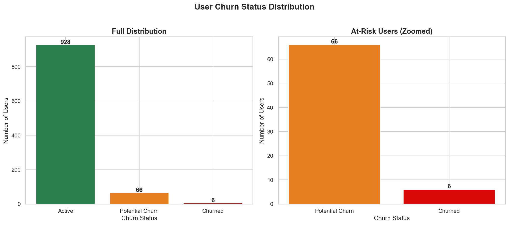
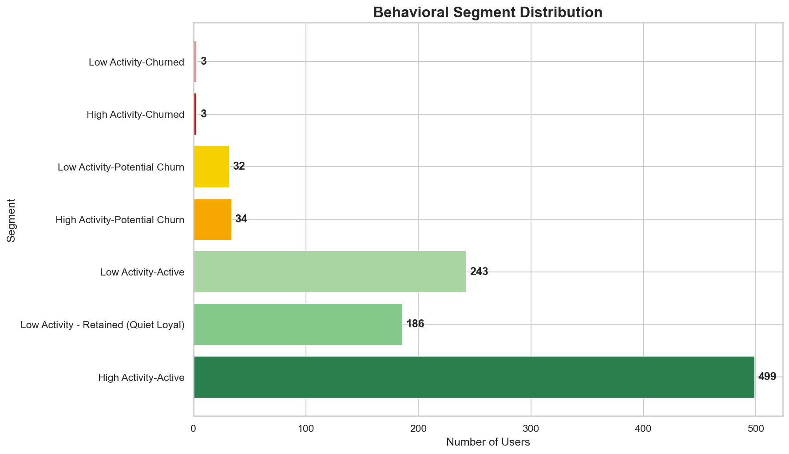
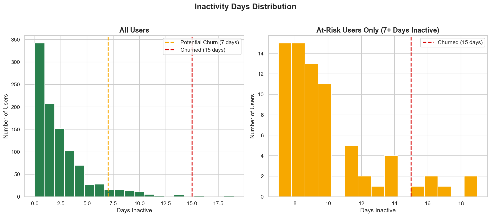
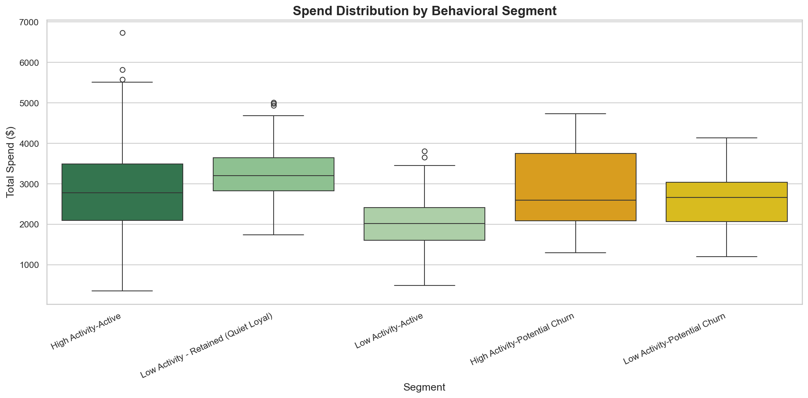
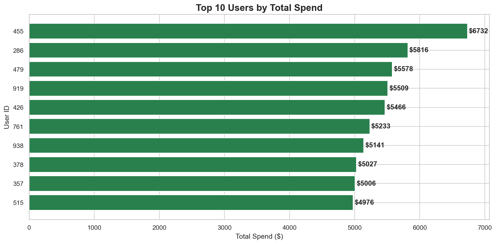

# Early Churn Risk Identification in E-Commerce Using Behavioral Segmentation

## Project Overview
This project analyzes 7 months of e-commerce clickstream data to identify 
users at risk of churning before they are fully lost. Using behavioral 
segmentation and inactivity tracking, the analysis surfaces early warning 
signals that traditional spend-based monitoring completely misses.

**The core business problem:** By the time a user churns, it's too late. 
This project builds an early detection system that flags at-risk users 
while there is still time to intervene.

---

## Dataset
- **Source:** Synthetic e-commerce clickstream dataset
- **Time Period:** January 1, 2024 – July 24, 2024
- **Size:** 74,817 events across 1,000 users
- **Columns:** UserID, SessionID, Timestamp, EventType, ProductID, Amount

---

## Tools & Technologies
- **Python** (pandas, numpy, matplotlib, seaborn)
- **Jupyter Notebooks** in VS Code
- **GitHub** for version control

---

## Project Structure
```
Ecommerce_Churn_Analysis/
├── data/
│   ├── raw/              # Original dataset (not pushed to GitHub)
│   └── cleaned/          # Processed datasets
├── notebooks/
│   ├── 01_data_cleaning.ipynb
│   ├── 02_user_features.ipynb
│   ├── 03_churn_labeling.ipynb
│   ├── 04_behavioral_segmentation.ipynb
│   └── 05_EDA_visuals_and_insights.ipynb
├── reports/
│   └── screenshots/      # All chart exports
├── README.md
└── requirements.txt
```

---

## Methodology

### Step 1 — Data Cleaning
Converted timestamps, removed redundant columns, handled null 
values, and sorted by user and time.

### Step 2 — User Feature Engineering
Aggregated 74,817 event-level rows into 1,000 user-level rows.
Calculated total events, sessions, purchases, spend, active days,
and purchase frequency per user.

### Step 3 — Churn Labeling
Applied a two-stage inactivity framework:

| Label | Inactivity | Count | % |
|-------|-----------|-------|---|
| Active | < 7 days | 928 | 92.8% |
| Potential Churn | 7–14 days | 66 | 6.6% |
| Churned | ≥ 15 days | 6 | 0.6% |

> Note: Original thresholds (25/30 days) were adjusted after 
> discovering the dataset's maximum inactivity was only 19 days.
> Thresholds must reflect actual data behavior, not assumptions.

### Step 4 — Behavioral Segmentation
Combined activity level (High/Low based on median events) with 
churn labels to create 7 behavioral segments. Identified Quiet 
Loyal Users — low activity users who purchase consistently above 
median frequency.

### Step 5 — EDA & Insights
Built 8 charts revealing patterns across segments, spend behavior,
inactivity distribution, and purchase frequency.

---

## Key Findings

**Finding 1: At-risk users are financially invisible**
Potential Churn users spend $2,629 vs Active users' $2,640 — 
a difference of only $11. Purchase frequency is identical at 10.0.
Spend monitoring alone would never catch these users.

**Finding 2: Quiet Loyal users are hidden high-value customers**
186 low-activity users purchase consistently above median frequency.
Two of the platform's top 10 spenders are Quiet Loyal users,
each spending nearly $5,000.

**Finding 3: The intervention window is narrow**
Users transition from healthy to fully churned within 15 days.
Early flagging at 7 days inactivity is the only reliable
intervention opportunity.

**Finding 4: High Activity Potential Churn is the most urgent segment**
34 highly engaged users show early churn signals. Their spend
and purchase behavior mirrors the best users on the platform —
making them the highest priority for immediate intervention.

---

## Recommendations

| Priority | Action | Target Segment |
|----------|--------|---------------|
| Immediate | Personalized re-engagement campaign | High Activity Potential Churn (34 users) |
| Immediate | Automated email nudge | Low Activity Potential Churn (32 users) |
| Short term | Frictionless experience + loyalty rewards | Quiet Loyal (186 users) |
| Short term | Product recommendation emails | Low Activity Active (243 users) |
| Long term | Automated 7-day inactivity alert system | All users |
| Long term | VIP treatment program | Top 10 spenders |

---

## Visualizations

### Churn Status Distribution


### Behavioral Segment Distribution


### Inactivity Days Distribution


### Spend Distribution by Segment


### Top 10 Users by Spend


---

## Analytical Limitations
- Synthetic dataset — real platforms show higher behavioral variance
  and typically higher churn rates (20-40%)
- Churned segment contains only 6 users — statistically insufficient
  for reliable conclusions about churned user behavior
- No demographic or product data available for deeper segmentation

---

## Author
**Lisa** | Aspiring Data Analyst
[GitHub](https://github.com/jannatenurlisa)

